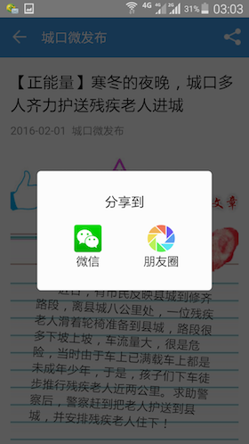
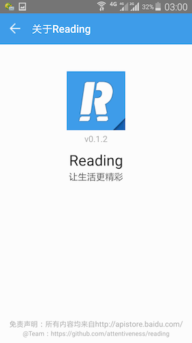

# Reading

Reading App Write In React-Native（Studying and Programing）

> No Profit, No Advertisement, Only Feelings

## Screenshot
 
 


## Download From Android Market
*From 360 Android Market:* [Download Reading](http://zhushou.360.cn/detail/index/soft_id/3217938?recrefer=SE_D_Reading)

*From Wandou Labs:* [Download Reading](http://www.wandoujia.com/apps/com.reading)

## Dependency
```
"dependencies": {
    "immutable": "^3.7.5",
    "react-native": "^0.19.0",
    "react-native-code-push": "^1.7.0-beta",
    "react-native-scrollable-tab-view": "^0.3.5",
    "react-native-wechat": "^1.2.5",
    "react-redux": "^4.2.1",
    "redux": "^3.2.1",
    "redux-thunk": "^1.0.3"
  }
```
## How To Build And Run
### Step One
```
npm install -g react-native-cli
```
### Step Two
```
npm install
```
### Step Three
```
react-native start
```
### Optional Step
```
npm run setup
```

## Welcome
>* Star
>* Fork
>* PR
>* Issue

## Thanks All!
*@Reading_Team*