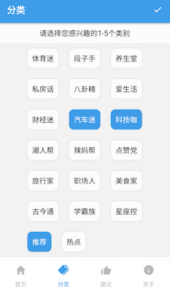
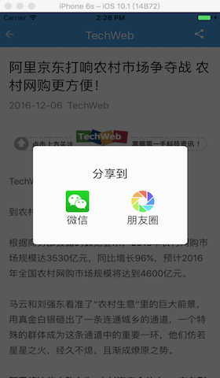

# iReading


[](https://travis-ci.org/attentiveness/reading)
[](https://codeclimate.com/github/attentiveness/reading)
[](https://gitter.im/attentiveness/reading)
[](https://raw.githubusercontent.com/attentiveness/reading/master/LICENSE)
[](https://github.com/attentiveness/reading/releases)
[](https://github.com/attentiveness/reading/pulls)

iReading App Write In React-Native（Studying and Programing）

**Support: Android 4.1 (API 16)+   IOS(8.0+)**

> No Profit, No Advertisement, Only Feelings

## Screenshot






## Download

### β Version(master branch)

*Android:* [Download iReading](http://fir.im/w7gu)

### From Android Market(Old)

*360 Android Market:* [Download iReading](http://zhushou.360.cn/detail/index/soft_id/3217938?recrefer=SE_D_Reading)

*Wandou Labs:* [Download iReading](http://www.wandoujia.com/apps/com.reading)

### From App Store(Old)

[Download iReading](https://itunes.apple.com/cn/app/ireading/id1135411121?l=zh&ls=1&mt=8)

## Application Architecture

- [Microsoft Code Push](https://github.com/Microsoft/react-native-code-push) for dynamic update.
- [Redux](https://github.com/reactjs/redux) is a predictable state container for reading application, together with [React Native](https://github.com/facebook/react-native).
- [Redux-Saga](https://github.com/yelouafi/redux-saga/) is a library that aims to make side effects in reading application easier and better.
- [react-navigation](https://github.com/react-community/react-navigation) is an extensible yet easy-to-use navigation solution, can also be used across React and React Native projects allowing for a higher degree of shared code.
- [Jest](https://facebook.github.io/jest/) for testing [React Native](https://github.com/facebook/react-native) components and UT.
- [Eslint](https://github.com/eslint/eslint) is a tool for identifying and reporting on patterns found in reading application code.
- [react-native-exceptions-manager](https://github.com/Richard-Cao/react-native-exceptions-manager) for handling crashes in release version.

## Development Workflow

### Step One

```
yarn(or npm) install -g react-native-cli
```
### Step Two

```
yarn(or npm) install
```
### Step Three

```
react-native start
```
### Run Test

```
yarn(or npm) test
```

### Format Code

```
yarn(or npm run) format
```

### Run Lint

```
yarn(or npm run) lint
```

## Release Note

[Reading Release Note](https://github.com/attentiveness/reading/releases)

## Contributing

**For more information about contributing PRs and issues, see our [Contribution Guidelines](https://github.com/attentiveness/reading/blob/master/CONTRIBUTING.md).**

## License

Apache License 2.0
