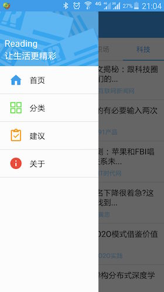
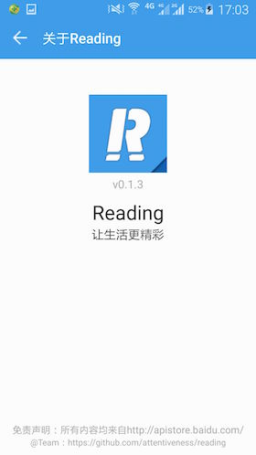

# Reading


[](https://gitter.im/attentiveness/reading)
[](https://raw.githubusercontent.com/attentiveness/reading/master/LICENSE)

Reading App Write In React-Native（Studying and Programing）

**Support: Android 4.1 (API 16)+    IOS(7.0+)**

> No Profit, No Advertisement, Only Feelings

## Screenshot

 
 
 
 

## Download From Android Market

*From 360 Android Market:* [Download Reading](http://zhushou.360.cn/detail/index/soft_id/3217938?recrefer=SE_D_Reading)

*From Wandou Labs:* [Download Reading](http://www.wandoujia.com/apps/com.reading)

## Application Architecture

* [Microsoft Code Push](https://github.com/Microsoft/react-native-code-push) for dynamic update
* [Redux](https://github.com/reactjs/redux) is a predictable state container for reading app, together with [React Native](https://github.com/facebook/react-native)
* [Mocha](https://mochajs.org/) for UT
* [Enzyme](https://github.com/airbnb/enzyme) for testing UI components and mock

## Development Workflow

### Step One
```
npm install -g react-native-cli
```
### Step Two
```
npm install
```
### Step Three
```
react-native start
```
### Run Test
```
npm test
```

## Release Note

[Reading Release Note](https://github.com/attentiveness/reading/releases)

## OnLine Accident

[Reading Online Accident](./Reading_OnLine_Accident.md)

## Welcome

>* Star
>* Fork
>* PR
>* Issue

## Contributing

For more information about contributing PRs and issues, see our [Contribution Guidelines](https://github.com/attentiveness/reading/blob/master/CONTRIBUTING.md).

## License

Apache License 2.0
